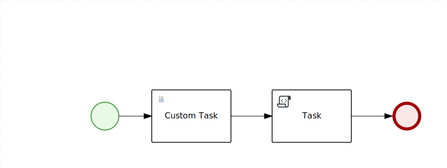

# Sample of the custom task in Kogito #



# Running

- Compile and Run

    ```
     mvn clean package quarkus:dev
    ```

- Native Image (requires JAVA_HOME to point to a valid GraalVM)

    ```
    mvn clean package -Pnative
    ```
  
  native executable (and runnable jar) generated in `target/`

# Test your application

Following command will call the process, pass the `some value` to the custom task and print some output.

```sh
curl -X POST "http://localhost:8080/greetings" -H  "accept: */*" -H  "Content-Type: application/json" -d "{\"input\":\"some value\"}"
```


# OpenAPI (Swagger) documentation
[Specification at swagger.io](https://swagger.io/docs/specification/about/)

The exposed service [OpenAPI specification](https://swagger.io/docs/specification) is generated at 
[/q/openapi](http://localhost:8080/q/openapi).

You can visualize and interact with the generated specification using the embbeded [Swagger UI](http://localhost:8080/q/swagger-ui) or importing the generated specification file on [Swagger Editor](https://editor.swagger.io).

In addition client application can be easily generated from the swagger definition to interact with this service.
